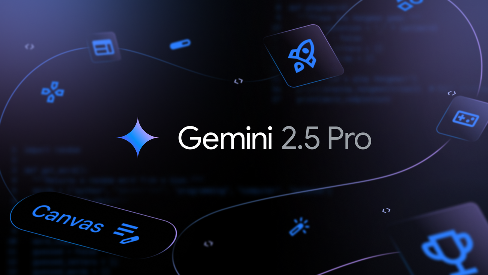
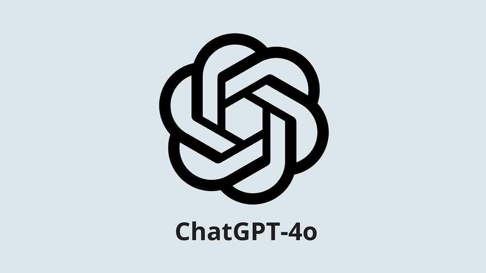

# OmniAnswer

<div align="center">

**A multi-modal, agent-based research assistant that finds, paraphrases, and aggregates high-quality answers across text, images, and video sources.**

[](https://www.python.org/)
[](LICENSE)

</div>

---

## 📑 Table of Contents

- [Project Context](#-project-context)
- [Key Features](#-key-features)
- [Tech Stack](#️-tech-stack)
- [Quickstart](#-quickstart)
  - [Prerequisites](#prerequisites)
  - [Installation](#installation)
- [Environment Variables](#-environment-variables)
- [Configuration](#️-configuration)
- [Project Structure](#-project-structure)
- [Usage Examples](#-usage-examples)
- [Docker Deployment](#-docker-deployment)
- [AWS ECS Deployment](#️-aws-ecs-deployment)
- [Evaluation](#-evaluation)
- [Development](#-development)
- [Architecture](#-architecture)
- [Troubleshooting](#-troubleshooting)
- [Contributing](#-contributing)
- [License](#-license)
- [Acknowledgements](#-acknowledgements)
- [Contact](#-contact)
- [Additional Resources](#-additional-resources)

---

## 📖 Project Context

This project was conceived in response to the rapidly evolving landscape of data science and artificial intelligence. As new technologies and methodologies emerge, it becomes increasingly challenging to find clear, concise, and authoritative answers to technical questions. The typical process often involves sifting through a multitude of resources—ranging from Medium articles, Towards Data Science posts, to countless YouTube videos—before finally discovering an article or video that truly clarifies the topic at hand.

**OmniAnswer** aims to streamline this journey by leveraging multi-modal agents and advanced language models to aggregate, paraphrase, and present the most relevant information from across the web, saving users time and effort in their search for knowledge.

---

## 🎯 Key Features

- **Multi-modality Support**: Text, images, and video retrieval and summarization
- **Agent-based Architecture**: Modular agents for each modality with a coordinating orchestration layer using CrewAI
- **Intelligent Paraphrasing**: Automatically rewrites queries to improve search recall for each modality
- **Content Moderation**: Configurable safety guardrails using OpenAI's moderation API to filter unsafe queries
- **Web Interface**: Gradio-based interactive frontend for easy interaction
- **Evaluation Pipeline**: Built-in evaluation with MLflow tracking for similarity metrics (text, image, video)
- **YAML-driven Configuration**: Hydra-compatible configuration system for easy experimentation
- **Docker Support**: Containerized deployment with Docker Compose
- **Cloud Ready**: ECS task definition included for AWS deployment

---

## 🛠️ Tech Stack

<p align="center">
  
  
  
  
  
  
  
</p>

**Core Technologies:**

- **Python 3.11** - Primary programming language
- **CrewAI** - Multi-agent orchestration framework
- **Hydra & OmegaConf** - Configuration management
- **Gradio** - Web interface framework
- **Pydantic** - Data validation and schemas
- **MLflow** - Experiment tracking and evaluation metrics

**AI/ML Services:**

- **OpenAI** - Content moderation and ChatGPT API calls
- **Google Gemini** - Primary LLM provider (default: gemini-2.5-pro)
- **Tavily** - Text search API
- **Google Custom Search** - Image search
- **SerpApi** - Video/YouTube search

<p align="center">
  
  
</p>

---

## 🚀 Quickstart

<p align="center">
  
</p>

**What it shows**: The development environment setup diagram (`assets/dev-env.png`) illustrates the step-by-step process for setting up the OmniAnswer project. It guides users through cloning the repository, creating a Python environment (conda or venv), installing dependencies, configuring environment variables, and launching the application. This diagram helps new users understand the complete installation workflow at a glance.

### Prerequisites

- Python 3.11+
- Conda (recommended) or venv
- API keys for the services you plan to use (see [Environment Variables](#environment-variables))

### Installation

1. **Clone the repository:**

```bash
git clone https://github.com/lydra4/OmniAnswer.git
cd OmniAnswer
```

2. **Create a Python environment and install dependencies:**

**Using conda (recommended):**

```bash
conda env create -f omnianswer-conda-env.yaml
conda activate omnianswer
```

Note: The conda environment file automatically installs both `requirements.txt` and `dev-requirements.txt` via pip.

**Using venv + pip:**

```bash
python -m venv .venv
# On Windows:
.venv\Scripts\activate
# On Unix/MacOS:
source .venv/bin/activate

pip install -r requirements.txt -r dev-requirements.txt
```

3. **Set up environment variables:**

Create a `.env` file in the project root with your API keys:

```bash
OPENAI_API_KEY=your_openai_key_here
GEMINI_API_KEY=your_gemini_key_here
TAVILY_API_KEY=your_tavily_key_here
GOOGLE_CSE_ID=your_google_cse_id_here
GOOGLE_API_KEY=your_google_api_key_here
SERP_API_KEY=your_serpapi_key_here
```

4. **Launch the Gradio Web Interface:**

```bash
python src/launch_gradio.py
```

The web interface will be available at `http://localhost:8080`. You can interact with the agents through the UI to ask questions and receive multi-modal search results.

---

## 🔧 Environment Variables

<p align="center">
  
</p>

**What it shows**: The environment variables guide (`assets/env-vars.png`) provides a visual overview of all required API keys and configuration variables needed to run OmniAnswer. It explains which services each variable connects to (OpenAI, Gemini, Tavily, Google Custom Search, SerpApi) and how they're used throughout the system. This diagram helps developers quickly identify which API keys they need to obtain and configure before running the application.

Required environment variables (store in `.env` or export in your shell):

| Variable         | Description                    | Required For                             |
| ---------------- | ------------------------------ | ---------------------------------------- |
| `OPENAI_API_KEY` | OpenAI API key                 | Content moderation and ChatGPT API calls |
| `GEMINI_API_KEY` | Google/Gemini API key          | Primary LLM provider                     |
| `TAVILY_API_KEY` | Tavily search API key          | Text search                              |
| `GOOGLE_CSE_ID`  | Google Custom Search Engine ID | Image search                             |
| `GOOGLE_API_KEY` | Google API key                 | Image search                             |
| `SERP_API_KEY`   | SerpApi key                    | Video/YouTube search                     |

Use `python-dotenv` (already included) to automatically load `.env` files in development.

---

## ⚙️ Configuration

<p align="center">
  
</p>

**What it shows**: The configuration structure diagram (`assets/config-structure.png`) visualizes the hierarchical organization of YAML configuration files in the `config/` directory. It shows how the main `pipeline.yaml` file references agent-specific configurations, evaluation settings, and logging configurations. This diagram helps developers understand how Hydra merges configurations and where to modify settings for different components of the system.

All runtime configuration lives in `config/`. The repository uses Hydra-style YAML configuration files.

### Main Configuration

- `config/pipeline.yaml` - Main pipeline configuration
  - Model selection (`model: gemini-2.5-pro`)
  - Temperature settings
  - Evaluation toggle
  - Gradio UI settings

### Agent Configurations

- `config/agent/text_agent.yaml` - Text search agent settings
- `config/agent/image_agent.yaml` - Image search agent settings
- `config/agent/video_agent.yaml` - Video search agent settings
- `config/agent/modality_agent.yaml` - Modality selection agent
- `config/agent/paraphrase_agent.yaml` - Query paraphrasing agent

### Other Configurations

- `config/logging.yaml` - Logging configuration (console and file handlers)
- `config/evaluation/evaluation.yaml` - Evaluation pipeline settings

Example configuration snippet:

```yaml
model: gemini-2.5-pro
temperature: 1.5
moderation_model: omni-moderation-latest
questions: "./data/questions/queries.txt"
evaluate: True
```

---

## 📁 Project Structure

<!-- Architecture diagram is shown in the Architecture section below -->

```
OmniAnswer/
├── assets/                        # Diagrams, logos, and images
│   ├── architecture.png           # System architecture diagram
│   ├── architecture.drawio        # Draw.io source for architecture
│   ├── dev-env.png                # Development environment setup
│   ├── dev-workflow.png           # Development workflow diagram
│   ├── env-vars.png               # Environment variables guide
│   └── *.png, *.jpg               # Technology logos
├── config/                        # YAML configuration files
│   ├── agent/                     # Agent-specific configurations
│   │   ├── text_agent.yaml        # Text search agent using TavilySearchTool
│   │   ├── image_agent.yaml       # Image search agent using Google Custom Search
│   │   ├── video_agent.yaml       # Video search agent using SerpApi
│   │   ├── modality_agent.yaml    # Modality selection agent (text/image/video)
│   │   └── paraphrase_agent.yaml  # Query paraphrasing agent for each modality
│   ├── evaluation/                # Evaluation pipeline config
│   │   └── evaluation.yaml        # MLflow tracking and similarity metrics config
│   ├── logging.yaml               # Logging configuration (console and file handlers)
│   └── pipeline.yaml              # Main pipeline config (model, temperature, evaluation)
├── docker/                        # Docker deployment files
│   ├── docker-compose.yml         # Docker Compose configuration
│   └── omnianswer.Dockerfile      # Docker image definition
├── ecs/                           # AWS ECS deployment config
│   └── task-definition.json       # ECS Fargate task definition
├── mlruns/                        # MLflow experiment tracking data
│   └── [experiment_id]/           # Experiment runs and metrics
├── src/                           # Source code
│   ├── agents/                    # Agent implementations
│   │   ├── base_agent/            # Base agent classes
│   │   │   └── base_agent_task.py # Base task implementation
│   │   ├── image_agent.py         # Image search agent
│   │   ├── modality_agent.py      # Modality selection agent
│   │   ├── paraphrase_agent.py    # Query paraphrasing agent
│   │   ├── text_agent.py          # Text search agent
│   │   └── video_agent.py         # Video search agent
│   ├── crew/                      # CrewAI orchestration
│   │   └── orchestrator.py        # Multi-agent crew coordinator
│   ├── evaluation/                # Evaluation pipeline
│   │   └── evaluation_pipeline.py # Similarity metrics computation
│   ├── frontend/                  # Gradio web interface
│   │   └── gradio_app.py          # Interactive web UI
│   ├── moderation/                # Content moderation
│   │   └── content_moderator.py   # OpenAI moderation API wrapper
│   ├── schemas/                   # Pydantic schemas
│   │   └── schemas.py             # Data models and validation
│   ├── tools/                     # Search tools
│   │   ├── image_search.py        # Google Custom Search integration
│   │   └── video_search.py        # SerpApi YouTube search integration
│   ├── utils/                     # Utility functions
│   │   ├── general_utils.py       # LLM loading, MLflow setup
│   │   └── pipeline_utils.py      # Component initialization, file processing
│   ├── launch_gradio.py           # Gradio launcher entrypoint
│   └── pipeline.py                # Batch pipeline entrypoint
├── tests/                         # Unit tests
│   ├── agents/                    # Agent tests
│   │   ├── multi_modality/
│   │   │   └── test_modality_agent.py
│   │   └── test_base_agent.py
│   └── conftest.py                # Pytest configuration
├── requirements.txt               # Runtime dependencies
├── dev-requirements.txt           # Development dependencies (testing, linting)
├── omnianswer-conda-env.yaml      # Conda environment definition
└── README.md
```

<p align="center">
  
</p>

**What it shows**: The development workflow diagram (`assets/dev-workflow.png`) illustrates the complete software development lifecycle for contributing to OmniAnswer. It shows the iterative process of editing code, running tests, applying linting and formatting tools (Black, Ruff, Pylint), committing changes, and deploying updates. This diagram helps contributors understand the recommended workflow for maintaining code quality and ensuring changes are properly tested before integration.

---

## 💻 Usage Examples

### Interactive Web Interface

Launch the Gradio interface:

```bash
python src/launch_gradio.py
```

Then open your browser to `http://localhost:8080` and start asking questions. The interface will:

1. Moderate your query for safety
2. Determine the best learning modalities (text, image, video)
3. Paraphrase queries for each modality
4. Search and return relevant URLs

---

## 🐳 Docker Deployment

### Build Docker Image Manually

```bash
docker build -f docker/omnianswer.Dockerfile -t omnianswer:latest .
docker run -p 8080:8080 --env-file .env omnianswer:latest
```

---

## ☁️ AWS ECS Deployment

The project includes an ECS task definition for deployment on AWS Fargate. See `ecs/task-definition.json` for configuration details.

**Key settings:**

- Network mode: `awsvpc`
- CPU: 1024 (1 vCPU)
- Memory: 2048 MB
- Port: 8080
- Health check: HTTP endpoint on port 8080

---

## 🧪 Evaluation

The evaluation pipeline computes similarity metrics for recommendations:

- **Text Similarity**: BERTScore for text recommendations
- **Image Similarity**: CLIP Score for image recommendations
- **Video Similarity**: X-CLIP Score for video recommendations

Results are tracked in MLflow. To enable evaluation, set `evaluate: True` in `config/pipeline.yaml`.

View MLflow results:

```bash
mlflow ui
```

Then open `http://localhost:5000` to view experiment runs and metrics.

---

## 🧪 Development

### Code Formatting and Linting

Format code with Black:

```bash
black .
```

Lint with Ruff:

```bash
ruff check .
ruff format .
```

Lint with Pylint:

```bash
pylint src
```

### Running Tests

Run the test suite:

```bash
pytest -q
```

Run tests with coverage:

```bash
pytest --cov=src --cov-report=html
```

### Pre-commit Hooks

Install pre-commit hooks:

```bash
pre-commit install
```

---

## 📊 Architecture

<p align="center">
  
</p>

**What it shows**: The architecture diagram (`assets/architecture.jpg`) provides a high-level overview of the OmniAnswer system's multi-agent architecture. It visualizes the flow of data from user queries through content moderation, modality selection, query paraphrasing, and multi-modal search orchestration. The diagram shows how different agents interact and how results are aggregated and returned to users. This helps developers understand the system's component relationships and data flow.

OmniAnswer follows a multi-agent architecture:

1. **Content Moderator**: Validates queries for safety using OpenAI's moderation API
2. **Modality Agent**: Determines which modalities (text, image, video) are best suited for a query
3. **Paraphrase Agent**: Rewrites the original query optimized for each selected modality
4. **Orchestrator**: Coordinates specialized agents (text, image, video) using CrewAI
   - **Text Agent**: Searches using Tavily API
   - **Image Agent**: Searches using Google Custom Search
   - **Video Agent**: Searches using SerpApi (YouTube)

The orchestrator aggregates results from all agents and returns structured recommendations.

### Evaluation Architecture

The evaluation pipeline is integrated into the main architecture and provides quantitative assessment of recommendation quality:

1. **Evaluation Pipeline** (`src/evaluation/evaluation_pipeline.py`): Computes modality-specific similarity metrics after the orchestrator returns results
   - **Text Evaluation**: Uses BERTScore to measure semantic similarity between paraphrased queries and scraped article content
     - Scrapes text from URLs using ScraperAPI
     - Extracts article content (preferring `<article>` tags, falling back to `<body>`)
     - Compares query paraphrases against scraped text using BERT-base-uncased embeddings
   - **Image Evaluation**: Uses CLIP Score to measure visual-text alignment
     - Downloads images from URLs
     - Computes CLIP-based similarity between image embeddings and query paraphrase embeddings
     - Uses OpenAI's CLIP-ViT-Base-Patch32 model
   - **Video Evaluation**: Uses X-CLIP Score to measure video-text alignment
     - Downloads video segments (default: 5 seconds) using yt-dlp and ffmpeg
     - Samples evenly-spaced frames based on model requirements (X-CLIP-base-patch32)
     - Computes cosine similarity between video and text embeddings in the X-CLIP embedding space

2. **MLflow Integration**: All evaluation metrics are automatically logged to MLflow for experiment tracking
   - Tracks text similarity, image similarity, and video similarity scores per query
   - Records model configuration (LLM name, temperature) and selected modalities
   - Enables comparison across different model configurations and hyperparameters
   - Stores results in `mlruns/` directory for analysis via MLflow UI

3. **Evaluation Configuration**: Controlled via `config/evaluation/evaluation.yaml`
   - Configurable model selection for each modality (BERT, CLIP, X-CLIP variants)
   - Adjustable parameters (text word count, video duration)
   - MLflow experiment naming and directory configuration

The evaluation pipeline runs automatically when `evaluate: True` is set in `config/pipeline.yaml`, allowing for systematic assessment of recommendation quality across different model configurations and query types.

---

## 🐛 Troubleshooting

### Missing API Key Errors

Ensure all required environment variables are set and visible to the running process. Check that your `.env` file is in the src folder.

### Configuration Not Picked Up

Confirm you're running the pipeline from the project root so relative `config/` paths resolve correctly. Hydra expects to be run from the project root.

### Import Errors

Make sure you've activated your conda/venv environment and installed all dependencies:

```bash
pip install -r requirements.txt -r dev-requirements.txt
```

### Port Already in Use

If port 8080 is already in use, modify the port in `src/frontend/gradio_app.py` or set the `GRADIO_SERVER_PORT` environment variable.

---

## 🤝 Contributing

Contributions are welcome! Here's a suggested workflow:

1. Fork the repository
2. Create a feature branch: `git checkout -b feat/your-feature`
3. Make your changes
4. Run tests and linters locally:
   ```bash
   pytest -q
   black .
   ruff check .
   ```
5. Commit your changes: `git commit -m "Add your feature"`
6. Push to your fork: `git push origin feat/your-feature`
7. Open a pull request describing your changes

Please follow existing coding standards and include tests for new behavior.

---

## 📝 License

This project is released under the MIT License. See `LICENSE` for details.

---

## 🙏 Acknowledgements

- **CrewAI** - Multi-agent orchestration framework
- **Hydra & OmegaConf** - Configuration management
- **OpenAI** - Content moderation API
- **Google Gemini** - Language model provider
- **Tavily** - Text search API
- **SerpApi** - Video search API
- **Google Custom Search** - Image search
- **MLflow** - Experiment tracking
- **Gradio** - Web interface framework

---

## 📧 Contact

If you have questions or want to collaborate, open an issue or PR on the repository:

**Repository**: https://github.com/lydra4/OmniAnswer

---

## 📚 Additional Resources

### Documentation Links

- **[CrewAI Documentation](https://docs.crewai.com/)** - Learn about multi-agent orchestration, agents, crews, and flows
- **[Hydra Documentation](https://hydra.cc/docs/intro/)** - Understand hierarchical configuration composition and command-line overrides
- **[MLflow Python API](https://mlflow.org/docs/latest/api_reference/python_api/index.html)** - Reference for experiment tracking, metrics logging, and model management

### Project Resources

- Check `config/` for detailed configuration options
- See `tests/` for example usage patterns
- Review `src/` for implementation details
- MLflow UI for experiment tracking and evaluation metrics (run `mlflow ui` to access)
