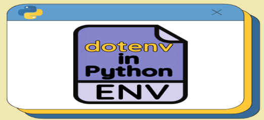

# OmniAnswer

## Project Context

This project was conceived in response to the rapidly evolving landscape of data science and artificial intelligence. As new technologies and methodologies emerge, it becomes increasingly challenging to find clear, concise, and authoritative answers to technical questions. The typical process often involves sifting through a multitude of resources—ranging from Medium articles, Towards Data Science posts, to countless YouTube videos—before finally discovering an article or video that truly clarifies the topic at hand. OmniAnswer aims to streamline this journey by leveraging multi-modal agents and advanced language models to aggregate, paraphrase, and present the most relevant information from across the web, saving users time and effort in their search for knowledge.

## Tech Stack

<p align="center">
  
  
  
  
  
  
  
</p>

<details>
<summary>Tech Stack Details</summary>

- **Python 3.11**
- [Hydra](https://hydra.cc/) (config management)
- [Omegaconf](https://omegaconf.readthedocs.io/)
- [Agno](https://github.com/agnos-ai/agno) (agent framework)
- [Google Search](https://docs.agno.com/tools/toolkits/search/googlesearch),
- [Google Images Search](https://github.com/arrrlo/Google-Images-Search),
- [SerpApi](https://serpapi.com/) (YouTube/video search)
- OpenAI & Gemini LLMs
- [Guardrails](https://github.com/shreya-shankar/guardrails) (safety)
- [Jinja2](https://jinja.palletsprojects.com/)
- [dotenv](https://pypi.org/project/python-dotenv/)
</details>

## Features

- **Multi-modality:** Answers queries using text, images, and videos.
- **Agent-based architecture:** Modular agents for each modality, with a team orchestration layer.
- **Paraphrasing:** Optimizes queries for each modality.
- **Guardrails:** Filters out unsafe or inappropriate queries.
- **Configurable:** YAML-based configuration for agents, teams, and logging.

## Architecture

<p align="center">
  
</p>

## Directory Structure

```
OmniAnswer/
├── assets/           # Readme file images
├── config/           # YAML configs for agents, teams, logging
├── logs/             # Log files (auto-generated)
├── outputs/          # Output results (if any)
├── src/
│   ├── agents/       # Agent implementations (base, single, multi-modality)
│   ├── teams/        # Team orchestration logic
│   └── utils/        # Utility functions
├── requirements.txt  # Python dependencies
├── dev-requirements.txt # Dev tools (linting, formatting)
├── omnianswer-conda-env.yaml # Conda environment
```

## Installation

### 1. Clone the repository

```bash
git clone [OmniAnswer](https://github.com/lydra4/OmniAnswer)
cd OmniAnswer
```

### 2. Set up environment

#### Using Conda (recommended)

```bash
conda env create -f omnianswer-conda-env.yaml
conda activate omnianswer
pip install -r requirements.txt -r dev-requirements.txt
```

#### For development

<p align="center">
  
</p>

```bash
pip install -r requirements.txt -r dev-requirements.txt
```

### 3. Environment Variables

<p align="center">
  
</p>

Set the following environment variables (e.g., in a `.env` file):

- `OPENAI_API_KEY` (for OpenAI models)
- `GEMINI_API_KEY` (for Gemini models and Google Images)
- `GOOGLE_CSE_ID` (for Google Custom Search)
- `SERP_API_KEY` (for YouTube/SerpApi search)
- `AGNO_API_KEY` (for Agno agent framework)

## Usage

Run the main entry point:

```bash
python src/main.py
```

This will:

1. Set up logging and configuration.
2. Load the specified LLM (OpenAI or Gemini).
3. Use the ModalityAgent to decide which modalities are needed for the query.
4. Paraphrase the query for each modality.
5. Use the MultiModalTeam to retrieve and aggregate answers from TextAgent, ImageAgent, and VideoAgent.

## Configuration

All configuration is managed via YAML files in the `config/` directory.

- `config.yaml`: Main entry config, sets model, temperature, and agent/team defaults.
- `logging.yaml`: Logging setup (console, file, error logs).
- `multi_modality/`, `single_modality/`, `teams/`: Per-agent/team configs (roles, system messages, parameters).

### Example: `config/config.yaml`

```yaml
defaults:
  - _self_
  - multi_modality/modality_agent@modality_agent: default
  - single_modality/paraphrase_agent@paraphrase_agent: default
  - single_modality/text_agent@text_agent: default
  - single_modality/image_agent@image_agent: default
  - single_modality/video_agent@video_agent: default
  - teams/multimodal_team@multimodal_team: default

model: gemini-2.5-pro
temperature: 1.0
```

## Agents

- **ModalityAgent:** Classifies which modalities (text, image, video) are needed for a query. Uses guardrails for safety.
- **ParaphraseAgent:** Rewrites queries for each modality to optimize search.
- **TextAgent:** Uses Google Search to find relevant articles and returns URLs.
- **ImageAgent:** Uses Google Images to find relevant images and returns URLs.
- **VideoAgent:** Uses YouTube/SerpApi to find relevant videos and returns URLs.

## Team Orchestration

- **MultiModalTeam:** Coordinates the above agents, aggregates their outputs, and returns a structured multi-modal answer.

## Logging

Logging is configured via `config/logging.yaml` and outputs to both console and log files in the `logs/` directory.

## Development

<p align="center">
  
</p>

- Code style: [black](https://github.com/psf/black), [ruff](https://github.com/astral-sh/ruff)
- Linting: [pylint](https://github.com/PyCQA/pylint)
- Pre-commit hooks: [pre-commit](https://pre-commit.com/)

## License

[MIT](LICENSE) (or specify your license)

## Acknowledgements

- [Agno](https://github.com/agnos-ai/agno) agent framework
- [Hydra](https://hydra.cc/)
- [Omegaconf](https://omegaconf.readthedocs.io/)
- [Google Search/Images/YouTube APIs]
- [SerpApi](https://serpapi.com/)
- [GoogleImagesSearch](https://github.com/arrrlo/Google-Images-Search)

---

> **Note:** If the images above do not render, please add the appropriate logos and diagrams to the `assets/` directory. You can use official logos from the respective technologies or create your own diagrams for environment variables and development workflow.
